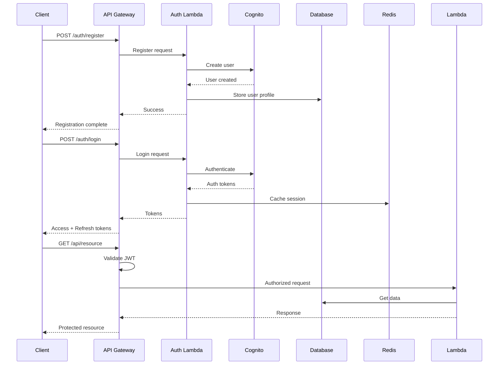

# Backend Architecture

## Service Architecture

### Function Organization

```text
apps/api/src/
├── functions/
│   ├── auth/
│   │   ├── register.ts
│   │   ├── login.ts
│   │   ├── refresh.ts
│   │   └── logout.ts
│   ├── emergency/
│   │   ├── contacts.ts
│   │   ├── hospitals.ts
│   │   ├── alert.ts
│   │   └── location.ts
│   ├── guides/
│   │   ├── list.ts
│   │   ├── detail.ts
│   │   ├── search.ts
│   │   └── bookmark.ts
│   └── medical/
│       ├── profile.ts
│       ├── allergies.ts
│       └── medications.ts
├── middleware/
│   ├── auth.ts
│   ├── errorHandler.ts
│   ├── validation.ts
│   └── rateLimiter.ts
├── services/
│   ├── database.ts
│   ├── cache.ts
│   ├── storage.ts
│   └── notification.ts
└── utils/
    ├── logger.ts
    ├── response.ts
    └── crypto.ts
```

### Function Template

```typescript
// functions/auth/login.ts
import { APIGatewayProxyHandler } from 'aws-lambda';
import { z } from 'zod';
import bcrypt from 'bcryptjs';
import jwt from 'jsonwebtoken';
import { createResponse, createErrorResponse } from '../../utils/response';
import { validateRequest } from '../../middleware/validation';
import { UserRepository } from '../../repositories/userRepository';
import { CacheService } from '../../services/cache';
import { logger } from '../../utils/logger';

const loginSchema = z.object({
  email: z.string().email(),
  password: z.string().min(8),
});

export const handler: APIGatewayProxyHandler = async (event, context) => {
  try {
    // Validate request
    const body = validateRequest(event.body, loginSchema);

    // Get user
    const userRepo = new UserRepository();
    const user = await userRepo.findByEmail(body.email);

    if (!user || !(await bcrypt.compare(body.password, user.passwordHash))) {
      return createErrorResponse(401, 'Invalid credentials');
    }

    // Generate tokens
    const accessToken = jwt.sign({ userId: user.id, email: user.email }, process.env.JWT_SECRET!, {
      expiresIn: '15m',
    });

    const refreshToken = jwt.sign({ userId: user.id }, process.env.JWT_REFRESH_SECRET!, {
      expiresIn: '30d',
    });

    // Cache session
    const cache = new CacheService();
    await cache.set(`session:${user.id}`, { refreshToken }, 30 * 24 * 60 * 60);

    // Log successful login
    logger.info('User logged in', { userId: user.id });

    return createResponse(200, {
      accessToken,
      refreshToken,
      expiresIn: 900,
      user: {
        id: user.id,
        email: user.email,
        profile: user.profile,
      },
    });
  } catch (error) {
    logger.error('Login error', error);
    return createErrorResponse(500, 'Internal server error');
  }
};
```

## Database Architecture

### Schema Design

```sql
-- See Database Schema section above for complete SQL
```

### Data Access Layer

```typescript
// repositories/baseRepository.ts
import { Pool } from 'pg';
import { CacheService } from '../services/cache';

export abstract class BaseRepository<T> {
  protected pool: Pool;
  protected cache: CacheService;
  protected tableName: string;

  constructor(tableName: string) {
    this.tableName = tableName;
    this.pool = new Pool({
      connectionString: process.env.DATABASE_URL,
      max: 20,
      idleTimeoutMillis: 30000,
    });
    this.cache = new CacheService();
  }

  async findById(id: string): Promise<T | null> {
    // Check cache first
    const cacheKey = `${this.tableName}:${id}`;
    const cached = await this.cache.get<T>(cacheKey);
    if (cached) return cached;

    // Query database
    const result = await this.pool.query(`SELECT * FROM ${this.tableName} WHERE id = $1`, [id]);

    if (result.rows.length === 0) return null;

    const entity = this.mapRowToEntity(result.rows[0]);

    // Cache for 5 minutes
    await this.cache.set(cacheKey, entity, 300);

    return entity;
  }

  async create(data: Partial<T>): Promise<T> {
    const columns = Object.keys(data);
    const values = Object.values(data);
    const placeholders = columns.map((_, i) => `$${i + 1}`);

    const query = `
      INSERT INTO ${this.tableName} (${columns.join(', ')})
      VALUES (${placeholders.join(', ')})
      RETURNING *
    `;

    const result = await this.pool.query(query, values);
    const entity = this.mapRowToEntity(result.rows[0]);

    // Invalidate cache
    await this.cache.delete(`${this.tableName}:list`);

    return entity;
  }

  abstract mapRowToEntity(row: any): T;
}

// repositories/emergencyContactRepository.ts
import { BaseRepository } from './baseRepository';
import { EmergencyContact } from '@shared/types';

export class EmergencyContactRepository extends BaseRepository<EmergencyContact> {
  constructor() {
    super('emergency_contacts');
  }

  async findByUserId(userId: string): Promise<EmergencyContact[]> {
    const result = await this.pool.query(
      'SELECT * FROM emergency_contacts WHERE user_id = $1 ORDER BY is_primary DESC, created_at ASC',
      [userId],
    );

    return result.rows.map((row) => this.mapRowToEntity(row));
  }

  async getPrimaryContact(userId: string): Promise<EmergencyContact | null> {
    const result = await this.pool.query(
      'SELECT * FROM emergency_contacts WHERE user_id = $1 AND is_primary = true LIMIT 1',
      [userId],
    );

    if (result.rows.length === 0) return null;

    return this.mapRowToEntity(result.rows[0]);
  }

  mapRowToEntity(row: any): EmergencyContact {
    return {
      id: row.id,
      userId: row.user_id,
      name: row.name,
      phone: row.phone,
      relationship: row.relationship,
      category: row.category,
      isPrimary: row.is_primary,
      notes: row.notes,
      createdAt: row.created_at,
      updatedAt: row.updated_at,
    };
  }
}
```

## Authentication and Authorization

### Auth Flow



### Middleware/Guards

```typescript
// middleware/auth.ts
import { APIGatewayProxyEvent, Context } from 'aws-lambda';
import jwt from 'jsonwebtoken';
import { CacheService } from '../services/cache';

export interface AuthenticatedEvent extends APIGatewayProxyEvent {
  user: {
    userId: string;
    email: string;
  };
}

export const authMiddleware = async (
  event: APIGatewayProxyEvent,
  context: Context,
  next: Function,
) => {
  try {
    const token = event.headers.Authorization?.replace('Bearer ', '');

    if (!token) {
      return {
        statusCode: 401,
        body: JSON.stringify({ error: 'No token provided' }),
      };
    }

    // Verify token
    const decoded = jwt.verify(token, process.env.JWT_SECRET!) as any;

    // Check if session is valid in cache
    const cache = new CacheService();
    const session = await cache.get(`session:${decoded.userId}`);

    if (!session) {
      return {
        statusCode: 401,
        body: JSON.stringify({ error: 'Session expired' }),
      };
    }

    // Attach user to event
    (event as AuthenticatedEvent).user = {
      userId: decoded.userId,
      email: decoded.email,
    };

    return next();
  } catch (error) {
    return {
      statusCode: 401,
      body: JSON.stringify({ error: 'Invalid token' }),
    };
  }
};

// Usage example
export const protectedHandler = authMiddleware(async (event: AuthenticatedEvent) => {
  // Access user from event.user
  const { userId } = event.user;

  // Protected logic here
  return {
    statusCode: 200,
    body: JSON.stringify({ userId, message: 'Protected resource' }),
  };
});
```
