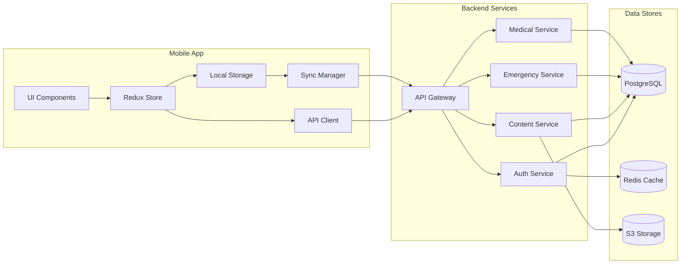

# Components

## Mobile App (React Native)

**Responsibility:** Cross-platform mobile application providing emergency first aid access

**Key Interfaces:**
- User authentication and profile management
- Emergency contact quick dial
- First aid guide browser and viewer
- Offline data synchronization
- Medical profile management

**Dependencies:** REST API, Local SQLite, AsyncStorage

**Technology Stack:** React Native 0.73+, TypeScript, Redux Toolkit, React Navigation

## Auth Service (Lambda)

**Responsibility:** Handle user authentication, registration, and token management

**Key Interfaces:**
- POST /auth/register
- POST /auth/login
- POST /auth/refresh
- POST /auth/logout

**Dependencies:** AWS Cognito, PostgreSQL, Redis

**Technology Stack:** Node.js, Express, AWS Lambda, JWT

## Content Service (Lambda)

**Responsibility:** Manage first aid guides and media content delivery

**Key Interfaces:**
- GET /guides
- GET /guides/:id
- GET /guides/download
- POST /guides/bookmark

**Dependencies:** PostgreSQL, S3, CloudFront

**Technology Stack:** Node.js, Express, AWS Lambda

## Emergency Service (Lambda)

**Responsibility:** Handle emergency-related features and integrations

**Key Interfaces:**
- GET /emergency/hospitals
- POST /emergency/alert
- GET /emergency/services
- POST /emergency/share-location

**Dependencies:** Google Maps API, Hospital APIs, PostgreSQL

**Technology Stack:** Node.js, Express, AWS Lambda

## Medical Profile Service (Lambda)

**Responsibility:** Manage user medical information securely

**Key Interfaces:**
- GET /medical-profile
- PUT /medical-profile
- GET /medical-profile/card
- POST /medical-profile/share

**Dependencies:** PostgreSQL, S3 (for medical cards)

**Technology Stack:** Node.js, Express, AWS Lambda

## Notification Service (Lambda)

**Responsibility:** Handle push notifications and alerts

**Key Interfaces:**
- POST /notifications/register-device
- POST /notifications/send
- PUT /notifications/preferences

**Dependencies:** FCM, APNS, PostgreSQL

**Technology Stack:** Node.js, AWS Lambda, SNS

## Component Diagrams

