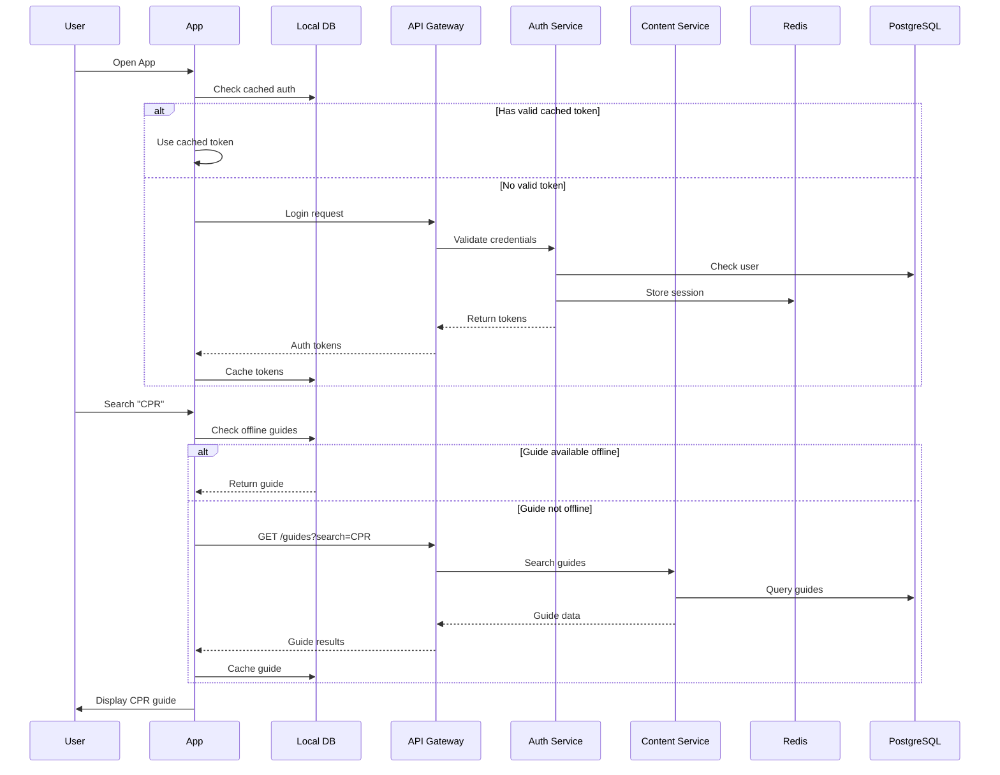
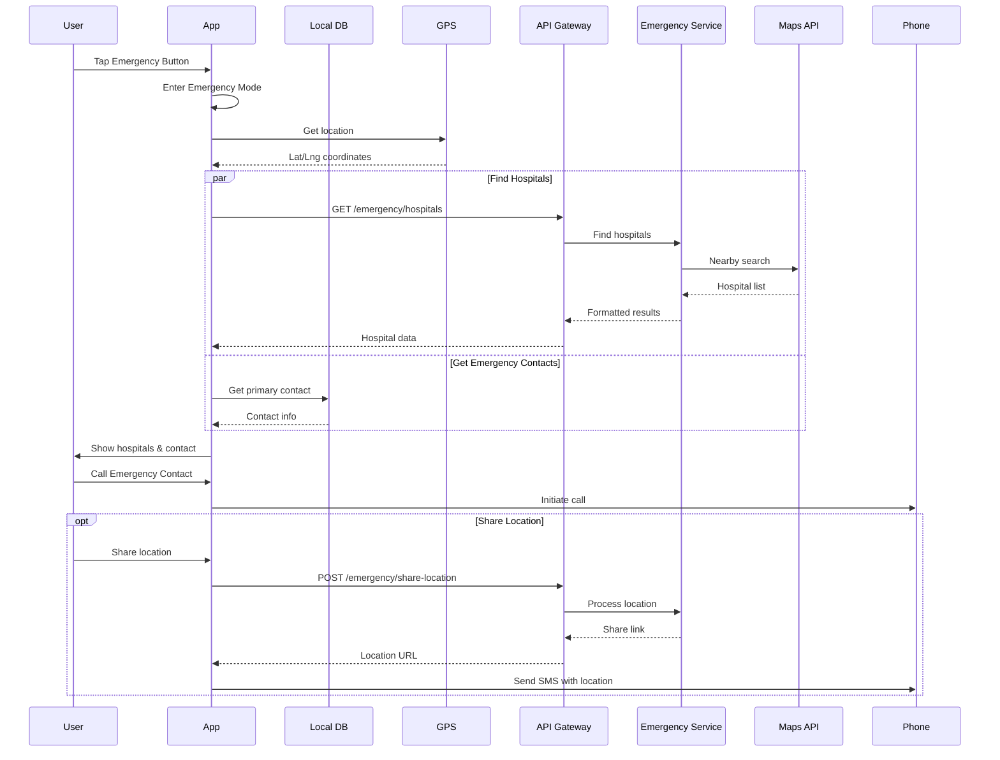

# Core Workflows

```mermaid
sequenceDiagram
    participant User
    participant App
    participant Local DB
    participant API Gateway
    participant Auth Service
    participant Content Service
    participant Redis
    participant PostgreSQL
    
    User->>App: Open App
    App->>Local DB: Check cached auth
    
    alt Has valid cached token
        App->>App: Use cached token
    else No valid token
        App->>API Gateway: Login request
        API Gateway->>Auth Service: Validate credentials
        Auth Service->>PostgreSQL: Check user
        Auth Service->>Redis: Store session
        Auth Service-->>API Gateway: Return tokens
        API Gateway-->>App: Auth tokens
        App->>Local DB: Cache tokens
    end
    
    User->>App: Search "CPR"
    App->>Local DB: Check offline guides
    
    alt Guide available offline
        Local DB-->>App: Return guide
    else Guide not offline
        App->>API Gateway: GET /guides?search=CPR
        API Gateway->>Content Service: Search guides
        Content Service->>PostgreSQL: Query guides
        Content Service-->>API Gateway: Guide data
        API Gateway-->>App: Guide results
        App->>Local DB: Cache guide
    end
    
    App->>User: Display CPR guide
```

```mermaid
sequenceDiagram
    participant User
    participant App
    participant Local DB
    participant GPS
    participant API Gateway
    participant Emergency Service
    participant Maps API
    participant Phone
    
    User->>App: Tap Emergency Button
    App->>App: Enter Emergency Mode
    App->>GPS: Get location
    GPS-->>App: Lat/Lng coordinates
    
    par Find Hospitals
        App->>API Gateway: GET /emergency/hospitals
        API Gateway->>Emergency Service: Find hospitals
        Emergency Service->>Maps API: Nearby search
        Maps API-->>Emergency Service: Hospital list
        Emergency Service-->>API Gateway: Formatted results
        API Gateway-->>App: Hospital data
    and Get Emergency Contacts
        App->>Local DB: Get primary contact
        Local DB-->>App: Contact info
    end
    
    App->>User: Show hospitals & contact
    User->>App: Call Emergency Contact
    App->>Phone: Initiate call
    
    opt Share Location
        User->>App: Share location
        App->>API Gateway: POST /emergency/share-location
        API Gateway->>Emergency Service: Process location
        Emergency Service-->>API Gateway: Share link
        API Gateway-->>App: Location URL
        App->>Phone: Send SMS with location
    end
```
