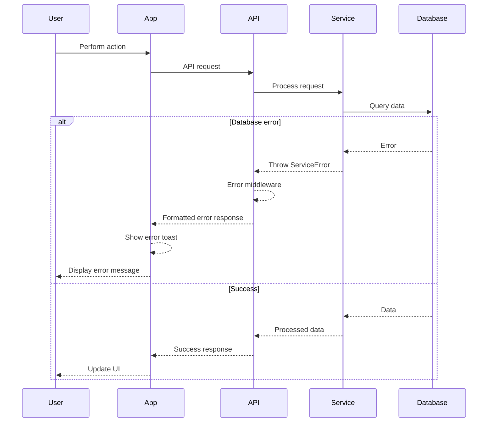

# Error Handling Strategy

## Error Flow



## Error Response Format

```typescript
interface ApiError {
  error: {
    code: string;
    message: string;
    details?: Record<string, any>;
    timestamp: string;
    requestId: string;
  };
}
```

## Frontend Error Handling

```typescript
// utils/errorHandler.ts
import { Alert } from 'react-native';
import * as Sentry from '@sentry/react-native';

export class ErrorHandler {
  static handle(error: any, context?: string) {
    console.error(`Error in ${context}:`, error);

    // Log to Sentry
    Sentry.captureException(error, {
      tags: { context },
    });

    // User-friendly message
    const message = this.getUserMessage(error);

    if (error.code === 'NETWORK_ERROR') {
      // Don't show alert for network errors in offline mode
      return;
    }

    Alert.alert('Error', message, [{ text: 'OK' }], { cancelable: true });
  }

  private static getUserMessage(error: any): string {
    const errorMessages: Record<string, string> = {
      AUTH_FAILED: 'Invalid email or password',
      NETWORK_ERROR: 'No internet connection',
      VALIDATION_ERROR: 'Please check your input',
      PERMISSION_DENIED: 'You do not have permission',
      NOT_FOUND: 'Resource not found',
    };

    return errorMessages[error.code] || 'Something went wrong. Please try again.';
  }
}

// Usage in component
try {
  await EmergencyService.addContact(contactData);
} catch (error) {
  ErrorHandler.handle(error, 'AddEmergencyContact');
}
```

## Backend Error Handling

```typescript
// middleware/errorHandler.ts
import { APIGatewayProxyResult } from 'aws-lambda';
import { v4 as uuidv4 } from 'uuid';
import { logger } from '../utils/logger';

export class AppError extends Error {
  constructor(
    public statusCode: number,
    public code: string,
    message: string,
    public details?: any,
  ) {
    super(message);
    this.name = 'AppError';
  }
}

export const errorHandler = (error: any): APIGatewayProxyResult => {
  const requestId = uuidv4();

  // Log error
  logger.error('Request failed', {
    error: error.message,
    stack: error.stack,
    requestId,
  });

  if (error instanceof AppError) {
    return {
      statusCode: error.statusCode,
      body: JSON.stringify({
        error: {
          code: error.code,
          message: error.message,
          details: error.details,
          timestamp: new Date().toISOString(),
          requestId,
        },
      }),
    };
  }

  // Generic error
  return {
    statusCode: 500,
    body: JSON.stringify({
      error: {
        code: 'INTERNAL_ERROR',
        message: 'An unexpected error occurred',
        timestamp: new Date().toISOString(),
        requestId,
      },
    }),
  };
};

// Usage in Lambda function
export const handler = async (event: APIGatewayProxyEvent) => {
  try {
    // Business logic
    if (!event.body) {
      throw new AppError(400, 'VALIDATION_ERROR', 'Request body is required');
    }

    // Process request...
  } catch (error) {
    return errorHandler(error);
  }
};
```
