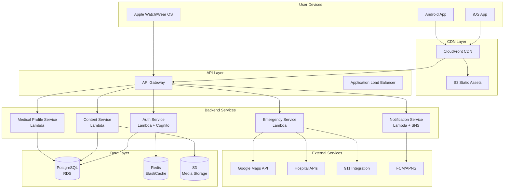

# High Level Architecture

## Technical Summary

The First Aid Room App employs a mobile-first architecture using React Native for cross-platform development, with a serverless backend on AWS for scalability and reliability. The frontend utilizes Redux Toolkit for state management with offline-first storage using SQLite and AsyncStorage. Backend services are built with Node.js Lambda functions exposed through API Gateway, with PostgreSQL for persistent data and Redis for caching. The architecture prioritizes offline functionality, sub-2-second emergency response times, and HIPAA-compliant data handling to meet critical medical emergency requirements.

## Platform and Infrastructure Choice

**Platform:** AWS Serverless Stack
**Key Services:** Lambda, API Gateway, RDS PostgreSQL, ElastiCache Redis, S3, CloudFront, Cognito
**Deployment Host and Regions:** US-East-1 (Primary), US-West-2 (DR), EU-West-1 (European expansion)

**Rationale**: AWS provides HIPAA-compliant infrastructure, global scalability, and comprehensive serverless services ideal for variable emergency response loads.

## Repository Structure

**Structure:** Monorepo
**Monorepo Tool:** Nx with npm workspaces
**Package Organization:** Apps (mobile, admin), Services (backend functions), Shared (types, utils, constants)

## High Level Architecture Diagram

## Architectural Patterns

- **Offline-First Architecture:** Local SQLite with background sync to cloud - _Rationale:_ Emergency access must work without connectivity
- **Serverless Microservices:** Lambda functions for each domain service - _Rationale:_ Scale to zero during quiet periods, instant scale during emergencies
- **Repository Pattern:** Abstract data access for both local and remote storage - _Rationale:_ Seamless offline/online data management
- **Event-Driven Updates:** SNS/SQS for async processing - _Rationale:_ Decouple critical path from non-essential operations
- **Component-Based UI:** Reusable React Native components with TypeScript - _Rationale:_ Rapid development and consistent emergency UI
- **BFF Pattern:** Mobile-optimized API responses - _Rationale:_ Minimize bandwidth usage for emergency scenarios
